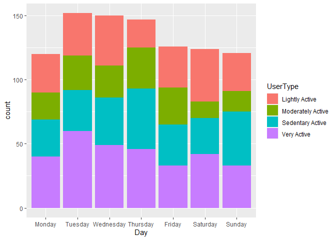
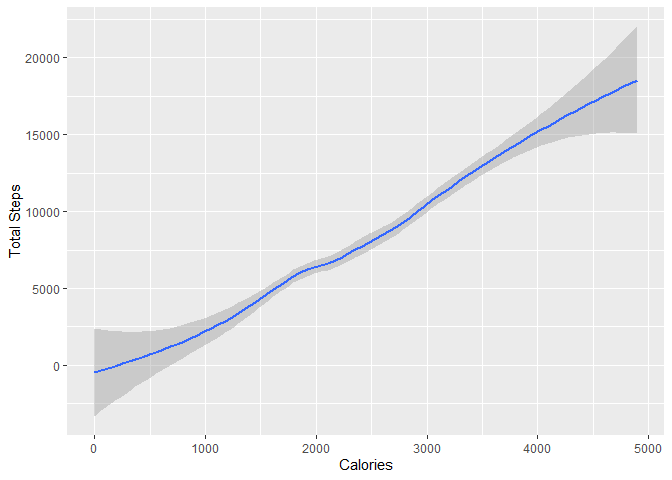

Wellness Technology Case Study - Bellabeat Analysis
================
Rachel Lau

<br>

### Scenario

In this scenario, I became a junior data analyst working on the
marketing analyst team at Bellabeat, a women-owned high-tect
manufacturer and wellness company of health-focused products for women.
Bellabeat was founded by Urška Sršen and Sandro Mur in 2014, based in
San Francisco. Sršen believes that analyzing smart device fitness data
could help on company’s development and gaining better future
opportunities. In this case study, we are going to explore and analyze a
fitness tracker dataset, while gaining insight for Bellabeat.

------------------------------------------------------------------------

### 1. Ask

<br>

#### 1.1 Objective/ Business task

Through analyzing a fitness tracker dataset and help guide marketing
strategy, suggestion, and plans for the company. <br>

#### 1.2 Stakeholders

Primary stakeholders:

- Urška Sršen, Bellabeat’s cofounder and chief creative officer
- Sandro Mur, mathemactician and Bellabeat’s cofounder
- Bellabeat marketing analytics team

Secondary stakeholders:

- Bellabeat’s users
- General public

<br>

### 2. Prepare

The data using in this case study is a public dataset from Kaggle, an
online community platform for data science learning. The dataset “FitBit
Fitness Tracker Data” contains s personal fitness tracker from thirty
fitbit users. Thirty eligible Fitbit users consented to the submission
of personal tracker data, including minute-level output for physical
activity, heart rate, and sleep monitoring. It includes information
about daily activity, steps, and heart rate that can be used to explore
users’ habits.

There are 18 comma-separated values (csv) files from the dataset. I
downloaded all of them and stored them in my laptop drive. Each files
are arranged, or ordered by the user Ids, and they both stored in long
and wide format.

We are going to identify the source of the data by checking the ROCCC.

<br>

#### Reliable

The dataset contains only 33 users, which may not be a good sample of
poplulation to represent all user from Fitbit. Also, the users’ age,
gender, races, and location are all unknown, which causes bias.

#### Original

The dataset generated by respondents to a distibuted survey via Amazon
Mechanical Turk. It made available through Möbius, one of a data
scientist from Kaggle user. This consider the dataset is a second-party
data, which the data was collected by a group directly from its
audience.

#### Comprehensive

The dataset contains important data such as number of calories burned,
steps each day walked etc. However, the age group and gender of the
users are missing and this might affect the insight we could gain.

#### Current

The dataset was collected between 03-12-2016 to 05-12-2016. A dataset
collected 6 years ago is considered out of date. Moreover, the time
period collected from the dataset had only three months, this might not
be a ideal time length for a good dataset.

#### Cited

Unknown. The dataset did not have any citation.

<br>

### 3. Process

I have choosen to use programming R for the case study project. In the
coming Process stage, we are going to use R to preview, sort, filter,
and clean the data.

<br>

#### 3.1 Install and load packages

First of all, we will install and load the packages that we need for the
project.

``` r
install.packages("tidyverse", repos = "http://cran.us.r-project.org")
```

    ## Installing package into 'C:/Users/rache/AppData/Local/R/win-library/4.2'
    ## (as 'lib' is unspecified)

    ## also installing the dependency 'cli'

    ## 
    ##   There is a binary version available but the source version is later:
    ##     binary source needs_compilation
    ## cli  3.6.0  3.6.1              TRUE
    ## 
    ## package 'tidyverse' successfully unpacked and MD5 sums checked
    ## 
    ## The downloaded binary packages are in
    ##  C:\Users\rache\AppData\Local\Temp\RtmpiOqNpE\downloaded_packages

    ## installing the source package 'cli'

    ## Warning in install.packages("tidyverse", repos =
    ## "http://cran.us.r-project.org"): installation of package 'cli' had non-zero exit
    ## status

``` r
install.packages("lubridate", repos = "http://cran.us.r-project.org")
```

    ## Installing package into 'C:/Users/rache/AppData/Local/R/win-library/4.2'
    ## (as 'lib' is unspecified)

    ## package 'lubridate' successfully unpacked and MD5 sums checked
    ## 
    ## The downloaded binary packages are in
    ##  C:\Users\rache\AppData\Local\Temp\RtmpiOqNpE\downloaded_packages

``` r
install.packages("skimr", repos = "http://cran.us.r-project.org")
```

    ## Installing package into 'C:/Users/rache/AppData/Local/R/win-library/4.2'
    ## (as 'lib' is unspecified)

    ## package 'skimr' successfully unpacked and MD5 sums checked
    ## 
    ## The downloaded binary packages are in
    ##  C:\Users\rache\AppData\Local\Temp\RtmpiOqNpE\downloaded_packages

``` r
install.packages("janitor", repos = "http://cran.us.r-project.org")
```

    ## Installing package into 'C:/Users/rache/AppData/Local/R/win-library/4.2'
    ## (as 'lib' is unspecified)

    ## package 'janitor' successfully unpacked and MD5 sums checked
    ## 
    ## The downloaded binary packages are in
    ##  C:\Users\rache\AppData\Local\Temp\RtmpiOqNpE\downloaded_packages

``` r
install.packages("Tmisc", repos = "http://cran.us.r-project.org")
```

    ## Installing package into 'C:/Users/rache/AppData/Local/R/win-library/4.2'
    ## (as 'lib' is unspecified)

    ## package 'Tmisc' successfully unpacked and MD5 sums checked
    ## 
    ## The downloaded binary packages are in
    ##  C:\Users\rache\AppData\Local\Temp\RtmpiOqNpE\downloaded_packages

``` r
install.packages("here", repos = "http://cran.us.r-project.org")
```

    ## Installing package into 'C:/Users/rache/AppData/Local/R/win-library/4.2'
    ## (as 'lib' is unspecified)

    ## package 'here' successfully unpacked and MD5 sums checked
    ## 
    ## The downloaded binary packages are in
    ##  C:\Users\rache\AppData\Local\Temp\RtmpiOqNpE\downloaded_packages

``` r
library(tidyverse)
```

    ## Warning: package 'tidyverse' was built under R version 4.2.3

    ## Warning: package 'lubridate' was built under R version 4.2.3

    ## ── Attaching core tidyverse packages ──────────────────────── tidyverse 2.0.0 ──
    ## ✔ dplyr     1.1.0     ✔ readr     2.1.4
    ## ✔ forcats   1.0.0     ✔ stringr   1.5.0
    ## ✔ ggplot2   3.4.1     ✔ tibble    3.1.8
    ## ✔ lubridate 1.9.2     ✔ tidyr     1.3.0
    ## ✔ purrr     1.0.1     
    ## ── Conflicts ────────────────────────────────────────── tidyverse_conflicts() ──
    ## ✖ dplyr::filter() masks stats::filter()
    ## ✖ dplyr::lag()    masks stats::lag()
    ## ℹ Use the ]8;;http://conflicted.r-lib.org/conflicted package]8;; to force all conflicts to become errors

``` r
library(lubridate)
library(skimr)
```

    ## Warning: package 'skimr' was built under R version 4.2.3

``` r
library(janitor)
```

    ## Warning: package 'janitor' was built under R version 4.2.3

    ## 
    ## Attaching package: 'janitor'
    ## 
    ## The following objects are masked from 'package:stats':
    ## 
    ##     chisq.test, fisher.test

``` r
library(Tmisc)
```

    ## Warning: package 'Tmisc' was built under R version 4.2.3

``` r
library(here)
```

    ## Warning: package 'here' was built under R version 4.2.3

    ## here() starts at C:/Users/rache/OneDrive/Documents/Wellness_technology_case_study

<br>

#### 3.2 Import data and view data

Then, we will import the data files and have a look on them.

``` r
daily_act <- read_csv("dailyActivity_merged.csv")   
```

    ## Rows: 940 Columns: 15
    ## ── Column specification ────────────────────────────────────────────────────────
    ## Delimiter: ","
    ## chr  (1): ActivityDate
    ## dbl (14): Id, TotalSteps, TotalDistance, TrackerDistance, LoggedActivitiesDi...
    ## 
    ## ℹ Use `spec()` to retrieve the full column specification for this data.
    ## ℹ Specify the column types or set `show_col_types = FALSE` to quiet this message.

``` r
daily_calories <- read_csv("dailyCalories_merged.csv")  
```

    ## Rows: 940 Columns: 3
    ## ── Column specification ────────────────────────────────────────────────────────
    ## Delimiter: ","
    ## chr (1): ActivityDay
    ## dbl (2): Id, Calories
    ## 
    ## ℹ Use `spec()` to retrieve the full column specification for this data.
    ## ℹ Specify the column types or set `show_col_types = FALSE` to quiet this message.

``` r
daily_steps <- read_csv("dailySteps_merged.csv")
```

    ## Rows: 940 Columns: 3
    ## ── Column specification ────────────────────────────────────────────────────────
    ## Delimiter: ","
    ## chr (1): ActivityDay
    ## dbl (2): Id, StepTotal
    ## 
    ## ℹ Use `spec()` to retrieve the full column specification for this data.
    ## ℹ Specify the column types or set `show_col_types = FALSE` to quiet this message.

We have read and saved the csv files and named them “daily_act”,
“daily_calories”, and “daily_steps”.

<br>

Then, we can use **head()** to preview the datasets.

``` r
head(daily_act)
```

    ## # A tibble: 6 × 15
    ##       Id Activ…¹ Total…² Total…³ Track…⁴ Logge…⁵ VeryA…⁶ Moder…⁷ Light…⁸ Seden…⁹
    ##    <dbl> <chr>     <dbl>   <dbl>   <dbl>   <dbl>   <dbl>   <dbl>   <dbl>   <dbl>
    ## 1 1.50e9 4/12/2…   13162    8.5     8.5        0    1.88   0.550    6.06       0
    ## 2 1.50e9 4/13/2…   10735    6.97    6.97       0    1.57   0.690    4.71       0
    ## 3 1.50e9 4/14/2…   10460    6.74    6.74       0    2.44   0.400    3.91       0
    ## 4 1.50e9 4/15/2…    9762    6.28    6.28       0    2.14   1.26     2.83       0
    ## 5 1.50e9 4/16/2…   12669    8.16    8.16       0    2.71   0.410    5.04       0
    ## 6 1.50e9 4/17/2…    9705    6.48    6.48       0    3.19   0.780    2.51       0
    ## # … with 5 more variables: VeryActiveMinutes <dbl>, FairlyActiveMinutes <dbl>,
    ## #   LightlyActiveMinutes <dbl>, SedentaryMinutes <dbl>, Calories <dbl>, and
    ## #   abbreviated variable names ¹​ActivityDate, ²​TotalSteps, ³​TotalDistance,
    ## #   ⁴​TrackerDistance, ⁵​LoggedActivitiesDistance, ⁶​VeryActiveDistance,
    ## #   ⁷​ModeratelyActiveDistance, ⁸​LightActiveDistance, ⁹​SedentaryActiveDistance

``` r
head(daily_calories)
```

    ## # A tibble: 6 × 3
    ##           Id ActivityDay Calories
    ##        <dbl> <chr>          <dbl>
    ## 1 1503960366 4/12/2016       1985
    ## 2 1503960366 4/13/2016       1797
    ## 3 1503960366 4/14/2016       1776
    ## 4 1503960366 4/15/2016       1745
    ## 5 1503960366 4/16/2016       1863
    ## 6 1503960366 4/17/2016       1728

``` r
head(daily_steps)
```

    ## # A tibble: 6 × 3
    ##           Id ActivityDay StepTotal
    ##        <dbl> <chr>           <dbl>
    ## 1 1503960366 4/12/2016       13162
    ## 2 1503960366 4/13/2016       10735
    ## 3 1503960366 4/14/2016       10460
    ## 4 1503960366 4/15/2016        9762
    ## 5 1503960366 4/16/2016       12669
    ## 6 1503960366 4/17/2016        9705

<br>

#### 3.3 Clean the datasets

The dataset mentioned it contain 30 people of sample size based on their
ID number (Id). We will need to check how many unique users (Id) in each
dataset.

``` r
n_unique(daily_act$Id)
```

    ## [1] 33

``` r
n_unique(daily_calories$Id)
```

    ## [1] 33

``` r
n_unique(daily_steps$Id)
```

    ## [1] 33

There are 33 users in each dataset in total.

<br>

Next, we need to check any duplicates by counting the sum of duplicates.

``` r
sum(duplicated(daily_act))
```

    ## [1] 0

``` r
sum(duplicated(daily_calories))
```

    ## [1] 0

``` r
sum(duplicated(daily_steps))
```

    ## [1] 0

Great. The code returns 0 that’s mean there are no duplicates.

After that, let’s remove any N/As using **distinct()** and **drop_na()**
function in the dataset.

``` r
daily_act <- daily_act %>% 
  distinct() %>% 
  drop_na()
daily_calories <- daily_calories %>% 
  distinct() %>% 
  drop_na()
daily_steps <- daily_steps %>% 
  distinct() %>% 
  drop_na()
```

<br>

Double check any missing value using **is.na()** function

``` r
sum(is.na(daily_act))
```

    ## [1] 0

Let’s check the data type by using **str()** function.

``` r
str(daily_act)
```

    ## tibble [940 × 15] (S3: tbl_df/tbl/data.frame)
    ##  $ Id                      : num [1:940] 1.5e+09 1.5e+09 1.5e+09 1.5e+09 1.5e+09 ...
    ##  $ ActivityDate            : chr [1:940] "4/12/2016" "4/13/2016" "4/14/2016" "4/15/2016" ...
    ##  $ TotalSteps              : num [1:940] 13162 10735 10460 9762 12669 ...
    ##  $ TotalDistance           : num [1:940] 8.5 6.97 6.74 6.28 8.16 ...
    ##  $ TrackerDistance         : num [1:940] 8.5 6.97 6.74 6.28 8.16 ...
    ##  $ LoggedActivitiesDistance: num [1:940] 0 0 0 0 0 0 0 0 0 0 ...
    ##  $ VeryActiveDistance      : num [1:940] 1.88 1.57 2.44 2.14 2.71 ...
    ##  $ ModeratelyActiveDistance: num [1:940] 0.55 0.69 0.4 1.26 0.41 ...
    ##  $ LightActiveDistance     : num [1:940] 6.06 4.71 3.91 2.83 5.04 ...
    ##  $ SedentaryActiveDistance : num [1:940] 0 0 0 0 0 0 0 0 0 0 ...
    ##  $ VeryActiveMinutes       : num [1:940] 25 21 30 29 36 38 42 50 28 19 ...
    ##  $ FairlyActiveMinutes     : num [1:940] 13 19 11 34 10 20 16 31 12 8 ...
    ##  $ LightlyActiveMinutes    : num [1:940] 328 217 181 209 221 164 233 264 205 211 ...
    ##  $ SedentaryMinutes        : num [1:940] 728 776 1218 726 773 ...
    ##  $ Calories                : num [1:940] 1985 1797 1776 1745 1863 ...

``` r
str(daily_calories)
```

    ## tibble [940 × 3] (S3: tbl_df/tbl/data.frame)
    ##  $ Id         : num [1:940] 1.5e+09 1.5e+09 1.5e+09 1.5e+09 1.5e+09 ...
    ##  $ ActivityDay: chr [1:940] "4/12/2016" "4/13/2016" "4/14/2016" "4/15/2016" ...
    ##  $ Calories   : num [1:940] 1985 1797 1776 1745 1863 ...

``` r
str(daily_steps)
```

    ## tibble [940 × 3] (S3: tbl_df/tbl/data.frame)
    ##  $ Id         : num [1:940] 1.5e+09 1.5e+09 1.5e+09 1.5e+09 1.5e+09 ...
    ##  $ ActivityDay: chr [1:940] "4/12/2016" "4/13/2016" "4/14/2016" "4/15/2016" ...
    ##  $ StepTotal  : num [1:940] 13162 10735 10460 9762 12669 ...

<br>

We can see that the data from column ActivityDate are formatted in *chr
(character)*. Since because it is a date, it should be stored as *Date*
type. To change the data type format, we will use the **mutate()**
function.

``` r
daily_act <- daily_act %>% 
  rename(Date = ActivityDate) %>%  # rename column name
  mutate(Date = as_date(Date, format = "%m/%d/%Y"))

daily_calories <- daily_calories %>%
  rename(Date = ActivityDay) %>% 
  mutate(Date = as_date(Date, format = "%m/%d/%Y")) # change data type format

daily_steps <- daily_steps %>% 
  rename(Date = ActivityDay) %>% 
  mutate(Date = as_date(Date, format = "%m/%d/%Y"))
```

Check the data type again, we can use **glimpse()** this time.

``` r
glimpse(daily_act)
```

    ## Rows: 940
    ## Columns: 15
    ## $ Id                       <dbl> 1503960366, 1503960366, 1503960366, 150396036…
    ## $ Date                     <date> 2016-04-12, 2016-04-13, 2016-04-14, 2016-04-…
    ## $ TotalSteps               <dbl> 13162, 10735, 10460, 9762, 12669, 9705, 13019…
    ## $ TotalDistance            <dbl> 8.50, 6.97, 6.74, 6.28, 8.16, 6.48, 8.59, 9.8…
    ## $ TrackerDistance          <dbl> 8.50, 6.97, 6.74, 6.28, 8.16, 6.48, 8.59, 9.8…
    ## $ LoggedActivitiesDistance <dbl> 0, 0, 0, 0, 0, 0, 0, 0, 0, 0, 0, 0, 0, 0, 0, …
    ## $ VeryActiveDistance       <dbl> 1.88, 1.57, 2.44, 2.14, 2.71, 3.19, 3.25, 3.5…
    ## $ ModeratelyActiveDistance <dbl> 0.55, 0.69, 0.40, 1.26, 0.41, 0.78, 0.64, 1.3…
    ## $ LightActiveDistance      <dbl> 6.06, 4.71, 3.91, 2.83, 5.04, 2.51, 4.71, 5.0…
    ## $ SedentaryActiveDistance  <dbl> 0, 0, 0, 0, 0, 0, 0, 0, 0, 0, 0, 0, 0, 0, 0, …
    ## $ VeryActiveMinutes        <dbl> 25, 21, 30, 29, 36, 38, 42, 50, 28, 19, 66, 4…
    ## $ FairlyActiveMinutes      <dbl> 13, 19, 11, 34, 10, 20, 16, 31, 12, 8, 27, 21…
    ## $ LightlyActiveMinutes     <dbl> 328, 217, 181, 209, 221, 164, 233, 264, 205, …
    ## $ SedentaryMinutes         <dbl> 728, 776, 1218, 726, 773, 539, 1149, 775, 818…
    ## $ Calories                 <dbl> 1985, 1797, 1776, 1745, 1863, 1728, 1921, 203…

``` r
glimpse(daily_calories)
```

    ## Rows: 940
    ## Columns: 3
    ## $ Id       <dbl> 1503960366, 1503960366, 1503960366, 1503960366, 1503960366, 1…
    ## $ Date     <date> 2016-04-12, 2016-04-13, 2016-04-14, 2016-04-15, 2016-04-16, …
    ## $ Calories <dbl> 1985, 1797, 1776, 1745, 1863, 1728, 1921, 2035, 1786, 1775, 1…

``` r
glimpse(daily_steps)
```

    ## Rows: 940
    ## Columns: 3
    ## $ Id        <dbl> 1503960366, 1503960366, 1503960366, 1503960366, 1503960366, …
    ## $ Date      <date> 2016-04-12, 2016-04-13, 2016-04-14, 2016-04-15, 2016-04-16,…
    ## $ StepTotal <dbl> 13162, 10735, 10460, 9762, 12669, 9705, 13019, 15506, 10544,…

The data type of ActivityDate has been changed to *date* and renamed as
“Date” successfully.

We would also like to add a new column showing the day of the week, to
help for analyzing later on.

``` r
daily_act <- daily_act %>% 
  mutate(Day = weekdays(daily_act$Date))
daily_calories <- daily_calories %>% 
  mutate(Day = weekdays(daily_calories$Date))
daily_steps <- daily_steps %>% 
  mutate(Day = weekdays(daily_steps$Date)) # Add a new column named 'Day' using the weekdays()
```

<br>

Let’s have a look at the new column, we now have a new column ‘Day’
showing which day is it.

``` r
head(daily_calories)
```

    ## # A tibble: 6 × 4
    ##           Id Date       Calories Day      
    ##        <dbl> <date>        <dbl> <chr>    
    ## 1 1503960366 2016-04-12     1985 Tuesday  
    ## 2 1503960366 2016-04-13     1797 Wednesday
    ## 3 1503960366 2016-04-14     1776 Thursday 
    ## 4 1503960366 2016-04-15     1745 Friday   
    ## 5 1503960366 2016-04-16     1863 Saturday 
    ## 6 1503960366 2016-04-17     1728 Sunday

<br>

### 4. Analyze

In the Analyze stage, we will start putting it to work.

First, let’s find the mean, max, min.

``` r
daily_act %>%
  group_by(Id) %>% 
  summarize(mean_steps = mean(TotalSteps),   
            max_steps = max(TotalSteps),
            min_steps = min(TotalSteps))
```

    ## # A tibble: 33 × 4
    ##            Id mean_steps max_steps min_steps
    ##         <dbl>      <dbl>     <dbl>     <dbl>
    ##  1 1503960366     12117.     18134         0
    ##  2 1624580081      5744.     36019      1510
    ##  3 1644430081      7283.     18213      1223
    ##  4 1844505072      2580.      8054         0
    ##  5 1927972279       916.      3790         0
    ##  6 2022484408     11371.     18387      3292
    ##  7 2026352035      5567.     12357       254
    ##  8 2320127002      4717.     10725       772
    ##  9 2347167796      9520.     22244        42
    ## 10 2873212765      7556.      9685      2524
    ## # … with 23 more rows

``` r
daily_act %>% 
  select(TotalSteps) %>% 
summary()
```

    ##    TotalSteps   
    ##  Min.   :    0  
    ##  1st Qu.: 3790  
    ##  Median : 7406  
    ##  Mean   : 7638  
    ##  3rd Qu.:10727  
    ##  Max.   :36019

The results showing that the mean daily steps of these 33 user is 7638,
while maximum is 36019 and minimum is 0.

We would like to distinguish the intention of the user by grouping them
into 4 categorizes by using the **mutute()** function to create a new
column. I will set 7500 here as the median number for the steps.

``` r
daily_act02 <- daily_act %>% 
  mutate(UserType = case_when(
    TotalSteps < 4000 ~ "Sedentary Active",
    TotalSteps >= 4000 & TotalSteps < 7500 ~ "Lightly Active",
    TotalSteps >= 7501 & TotalSteps < 10000 ~ "Moderately Active",
    TotalSteps >= 10001 ~ "Very Active"
  ))
as_tibble(daily_act02)
```

    ## # A tibble: 940 × 17
    ##            Id Date       Total…¹ Total…² Track…³ Logge…⁴ VeryA…⁵ Moder…⁶ Light…⁷
    ##         <dbl> <date>       <dbl>   <dbl>   <dbl>   <dbl>   <dbl>   <dbl>   <dbl>
    ##  1 1503960366 2016-04-12   13162    8.5     8.5        0    1.88   0.550    6.06
    ##  2 1503960366 2016-04-13   10735    6.97    6.97       0    1.57   0.690    4.71
    ##  3 1503960366 2016-04-14   10460    6.74    6.74       0    2.44   0.400    3.91
    ##  4 1503960366 2016-04-15    9762    6.28    6.28       0    2.14   1.26     2.83
    ##  5 1503960366 2016-04-16   12669    8.16    8.16       0    2.71   0.410    5.04
    ##  6 1503960366 2016-04-17    9705    6.48    6.48       0    3.19   0.780    2.51
    ##  7 1503960366 2016-04-18   13019    8.59    8.59       0    3.25   0.640    4.71
    ##  8 1503960366 2016-04-19   15506    9.88    9.88       0    3.53   1.32     5.03
    ##  9 1503960366 2016-04-20   10544    6.68    6.68       0    1.96   0.480    4.24
    ## 10 1503960366 2016-04-21    9819    6.34    6.34       0    1.34   0.350    4.65
    ## # … with 930 more rows, 8 more variables: SedentaryActiveDistance <dbl>,
    ## #   VeryActiveMinutes <dbl>, FairlyActiveMinutes <dbl>,
    ## #   LightlyActiveMinutes <dbl>, SedentaryMinutes <dbl>, Calories <dbl>,
    ## #   Day <chr>, UserType <chr>, and abbreviated variable names ¹​TotalSteps,
    ## #   ²​TotalDistance, ³​TrackerDistance, ⁴​LoggedActivitiesDistance,
    ## #   ⁵​VeryActiveDistance, ⁶​ModeratelyActiveDistance, ⁷​LightActiveDistance

``` r
daily_act02 %>% 
  select(Id, Date, TotalSteps, Calories, Day, UserType)
```

    ## # A tibble: 940 × 6
    ##            Id Date       TotalSteps Calories Day       UserType         
    ##         <dbl> <date>          <dbl>    <dbl> <chr>     <chr>            
    ##  1 1503960366 2016-04-12      13162     1985 Tuesday   Very Active      
    ##  2 1503960366 2016-04-13      10735     1797 Wednesday Very Active      
    ##  3 1503960366 2016-04-14      10460     1776 Thursday  Very Active      
    ##  4 1503960366 2016-04-15       9762     1745 Friday    Moderately Active
    ##  5 1503960366 2016-04-16      12669     1863 Saturday  Very Active      
    ##  6 1503960366 2016-04-17       9705     1728 Sunday    Moderately Active
    ##  7 1503960366 2016-04-18      13019     1921 Monday    Very Active      
    ##  8 1503960366 2016-04-19      15506     2035 Tuesday   Very Active      
    ##  9 1503960366 2016-04-20      10544     1786 Wednesday Very Active      
    ## 10 1503960366 2016-04-21       9819     1775 Thursday  Moderately Active
    ## # … with 930 more rows

<br>

### 5. Share

Let’s create some visual graph to have a look.

``` r
install.packages("ggplot2") # install and load package 
```

    ## Warning: package 'ggplot2' is in use and will not be installed

``` r
library(ggplot2)

daily_act02$Day <- factor(daily_act02$Day, levels = c("Monday", "Tuesday", "Wednesday", "Thursday", "Friday", "Saturday", "Sunday"))

ggplot(data = daily_act02)+
  geom_bar(mapping = aes(x=Day, fill=UserType))
```

<!-- -->

<br>

Some findings

- The bar chart above showing that Tuesday and Wednesday have the most
  user are being active, while Monday and Sunday have less user being
  active
- Wednesday and Saturday have the most user who are consider “lightly
  active” compared to the rest of the days

<br>

Now, let’s going through the relationship between total steps and
calories, we will use *geom_smooth()* function to graph for the two
variables.

``` r
ggplot(data = daily_act02)+
  geom_smooth(mapping = aes(x=Calories, y=TotalSteps)) + ylab('Total Steps')
```

    ## `geom_smooth()` using method = 'loess' and formula = 'y ~ x'

<!-- -->

<br>

Some findings

- The trend went very smooth, showing a positive relationship between
  total steps walked each day and calories burned each day. The more
  steps user walked, the more calories they can burn

<br>

### 6. Act

<br>

#### Conclusion and recommendation

Summed up the factors that we outlined above, we can draw the conclusion
that users have preference on week of day to be active or less active.

<br>

1.  Bellabeat app notification All user from Bellabeat are linked and
    being tracked to their smart device. Mobile app development team may
    consider sending notification when user are being not that active
    enough on the Day they usually being lazy.

2.  Health information Everyone know regularly exercising are benefits
    to their body. People from now a days are being busy from their work
    and school. The mobile app could send user reminder if they didn’t
    walk sufficient amount of steps or not being active for a time
    period.

<br>
